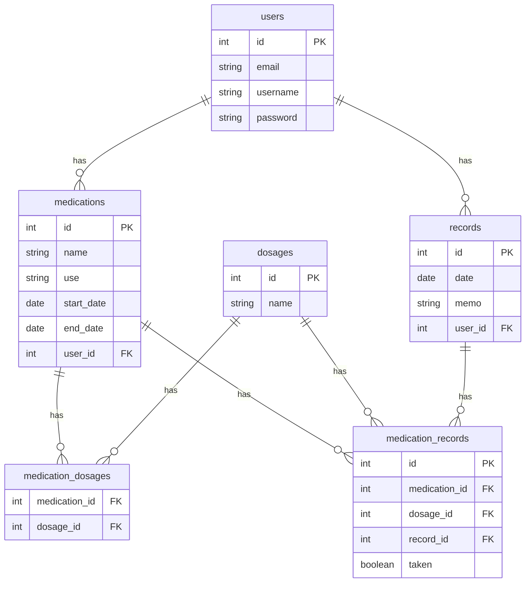

# お薬管理アプリ「くすログ」

## アプリ概要
服薬予定の内服薬やサプリメントを登録し、その日ごとに服用記録をチェックできる。その日のお薬を全て服用完了したら、カレンダーにチェックが入るため、飲み忘れの頻度も一目瞭然である。

## アプリ画像

## アプリURL

## 開発背景
調剤薬局での勤務を通じて、複数の医療機関から多くのお薬を処方されている患者様が多いことに気づいた。その中で、「お薬をよく飲み忘れる」、「どれが何の薬か分からなくなる」とおっしゃる方々も少なくない。
そこで、服用のチェック及び、体調の変化などを手軽に記録・可視化できるシンプルなアプリがあれば、患者様の服用状況や体調の把握が容易となるため、より安全に確実にお薬を飲んでいただけるのではないかと考えた。
また、薬局側としても、重複投与や相互作用による医師への疑義照会の手間を省ける可能性が高まり、待ち時間の短縮にも繋がるため、円滑な薬局運営も期待できる。
これらの背景から、この服薬アプリを開発した。

## ターゲットユーザー
多数の内服薬やサプリメントを服用されている患者様

## 主な機能
- ユーザー登録
- ログイン
- 服薬記録
- 今日のお薬リスト（服用チェック機能・体調管理メモ）
- カレンダー表示（服用完了でチェックマーク付与・カレンダークリックにて服薬履歴及び体調メモ内容確認）
など

## 主な使用技術
フロントエンド
- HTML / CSS

バックエンド
- Ruby / Ruby on Rails

バージョン管理
- GitHub

デプロイ
- Render

## ER図

## 工夫した点
- 薬の登録時に薬の目的・用途をメモとして残せるようにした
- 今日のお薬リストは用法（朝・昼・夕・就寝前など）の時系列順に表示されるよう実装した
- 終了日を未入力のまま登録すると「服用中」と判定され、毎日の薬リストに自動で表示される仕様にした
- 1日分の服用チェックが完了するとカレンダーに印がつく仕組みにし、服薬の継続状況を一目で確認できるようにした
- 「手軽さ・使いやすさ」をコンセプトに機能を最小限に絞り、UIもシンプルで統一感のあるデザインにした

## 今後実装したい機能

- 服用時刻の設定およびプッシュ通知
- 飲み忘れ率の集計・グラフ表示
- 外用薬・注射薬など内服以外の薬の管理
- 不均等・漸減・隔日投与・一包化など、複雑な用法への対応
- 薬剤データベースとの連携による薬名検索・登録の効率化
- 薬を削除した際、その薬の今までの服用記録の保持
- 体調メモのAI要約機能
- スマホ対応(レスポンシブ設定)

